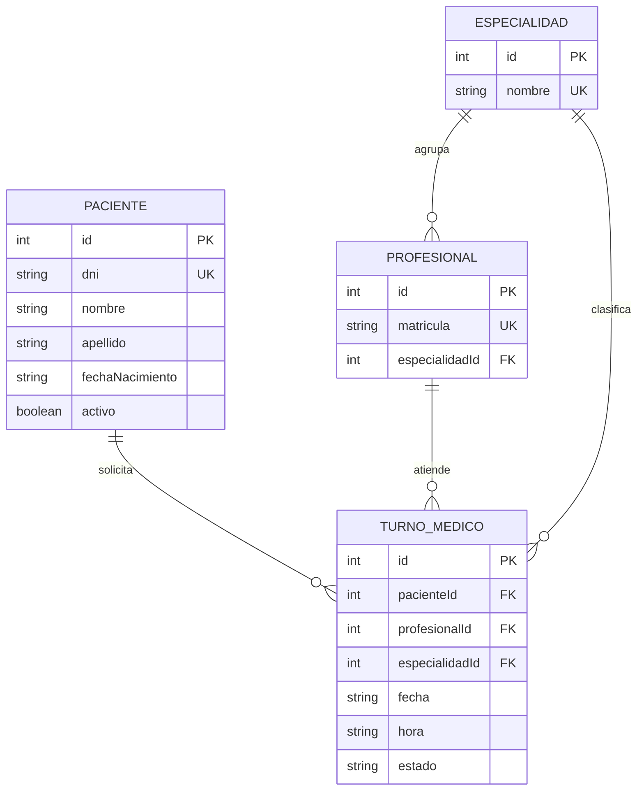

# Módulo Pacientes y Turnos Médicos — propuesta de diseño

> **Estado: mockup / propuesta.** Este documento define el modelo de datos y la interfaz del servidor
> para que el equipo de **Frontend** pueda avanzar en paralelo. **No hay controllers ni CRUD implementados
> todavía**; solo existen las interfaces TypeScript de referencia en
> [`src/models/pacientes.model.ts`](src/models/pacientes.model.ts) y
> [`src/models/turnos-medicos.model.ts`](src/models/turnos-medicos.model.ts) (tipos compilados, sin lógica).

## Índice

1. [Objetivo y alcance](#1-objetivo-y-alcance)
2. [Modelado de datos](#2-modelado-de-datos)
   - [2.1 Paciente](#21-paciente) · [2.2 Turno médico](#22-turno-médico) · [2.3 Estados del turno](#23-estados-del-turno)
   - [2.4 Relaciones entre entidades](#24-relaciones-entre-entidades) · [2.5 Relación con el Turno actual](#25-relación-con-el-turno-actual)
   - [2.6 Decisiones y datos sensibles](#26-decisiones-y-datos-sensibles)
3. [Endpoints propuestos](#3-endpoints-propuestos)
   - [3.1 Convenciones comunes](#31-convenciones-comunes) · [3.2 `POST /pacientes`](#32-post-pacientes)
   - [3.3 `GET /pacientes/:id/turnos`](#33-get-pacientesidturnos) · [3.4 Cómo se implementarían (Clean Architecture)](#34-cómo-se-implementarían-clean-architecture)
4. [Guía rápida para Frontend](#4-guía-rápida-para-frontend)
5. [Próximos pasos](#5-próximos-pasos)

---

## 1. Objetivo y alcance

Hoy un turno guarda al paciente como texto suelto (`paciente: "Carlos Ruiz"`, `documento: "31654210"`), por lo que
no se puede saber cuántos turnos tiene una persona, ni contactarla, ni evitar datos duplicados o mal escritos.
La propuesta introduce **Paciente** como entidad propia y hace que el **Turno** se relacione con ella (y con el
**Profesional**) por id.

| Incluido en esta propuesta                                  | Fuera de alcance (por ahora)                     |
| ----------------------------------------------------------- | ------------------------------------------------ |
| Modelo de datos de Paciente y Turno médico                  | Implementación de controllers, servicios y rutas |
| Contrato de `POST /pacientes` y `GET /pacientes/:id/turnos` | Resto del CRUD de pacientes (`GET/PUT/DELETE`)   |
| Reglas de negocio y validaciones esperadas                  | `POST /turnos-medicos` y cambios de estado       |
| Guía de consumo para Frontend                               | Autenticación/autorización y paginación          |

## 2. Modelado de datos

Las interfaces se diseñaron primero en TypeScript (y compilan con `npm run build`); las tablas de abajo explican
**por qué** existe cada campo.

### 2.1 Paciente

```typescript
export type Sexo = 'F' | 'M' | 'X';

export interface ContactoPaciente {
  telefono: string;
  email?: string;
  direccion?: string;
}

export interface ObraSocial {
  nombre: string;
  numeroAfiliado: string;
}

export interface Paciente {
  id: number;
  dni: string; // solo dígitos (7 u 8), sin puntos; único
  nombre: string;
  apellido: string;
  fechaNacimiento: string; // ISO YYYY-MM-DD; la edad se calcula
  sexo?: Sexo;
  contacto: ContactoPaciente;
  obraSocial?: ObraSocial;
  activo: boolean; // baja lógica
  creadoEn: string; // ISO 8601 (UTC)
  actualizadoEn: string;
}

// Lo que envía el cliente en POST /pacientes (el servidor asigna id, activo y marcas de tiempo)
export type CreatePacienteInput = Omit<Paciente, 'id' | 'activo' | 'creadoEn' | 'actualizadoEn'> & {
  activo?: boolean;
};
```

| Campo                       | Obligatorio | Por qué existe                                                                                                                          |
| --------------------------- | :---------: | --------------------------------------------------------------------------------------------------------------------------------------- |
| `id`                        | (servidor)  | Identificador interno estable; lo usan los turnos (`pacienteId`). No se usa el DNI como clave para poder corregirlo.                    |
| `dni`                       |     Sí      | Identificador legal de la persona. **Único**: evita pacientes duplicados. Se guarda como texto para no perder ceros.                    |
| `nombre`, `apellido`        |     Sí      | Identificación en agenda, recepción y comprobantes. Se separan (no `nombreCompleto`) para ordenar y buscar por apellido.                |
| `fechaNacimiento`           |     Sí      | Determina edad (pediatría vs. adultos), dosis y coberturas. Se guarda la fecha; la **edad se calcula**, así nunca queda desactualizada. |
| `sexo`                      |     No      | Dato clínico relevante para algunos estudios y prácticas; opcional y con opción `X` para no forzar una respuesta.                       |
| `contacto.telefono`         |     Sí      | Canal mínimo para confirmar, reprogramar o cancelar turnos.                                                                             |
| `contacto.email`            |     No      | Canal alternativo/recordatorios; si se envía debe tener formato válido.                                                                 |
| `contacto.direccion`        |     No      | Domicilio (facturación, derivaciones); no es necesario para dar un turno.                                                               |
| `obraSocial`                |     No      | Cobertura (`nombre` + `numeroAfiliado`); un paciente puede atenderse de forma particular. Va junta porque una sin la otra no sirve.     |
| `activo`                    |     No      | Baja lógica (por defecto `true`): conserva el historial de turnos aunque el paciente ya no se atienda.                                  |
| `creadoEn`, `actualizadoEn` | (servidor)  | Auditoría y sincronización del Frontend; los asigna el servidor, el cliente no puede falsificarlos.                                     |

### 2.2 Turno médico

```typescript
export const ESTADOS_TURNO = [
  'PENDIENTE',
  'CONFIRMADO',
  'ATENDIDO',
  'CANCELADO',
  'AUSENTE',
] as const;
export type EstadoTurno = (typeof ESTADOS_TURNO)[number];

export interface TurnoMedico {
  id: number;
  pacienteId: number; // → Paciente.id
  profesionalId: number; // → Profesional.id
  especialidadId: number; // → Especialidad.id (coincide con la del profesional)
  fecha: string; // ISO YYYY-MM-DD
  hora: string; // HH:mm (24 hs), hora de inicio
  duracionMinutos: number;
  estado: EstadoTurno;
  motivo?: string; // motivo de consulta declarado por el paciente
  observaciones?: string; // notas internas
  creadoEn: string;
  actualizadoEn: string;
}
```

| Campo                       | Por qué existe                                                                                                                             |
| --------------------------- | ------------------------------------------------------------------------------------------------------------------------------------------ |
| `pacienteId`                | **Reemplaza a `paciente` + `documento` sueltos**: el turno apunta a una persona real, con contacto y obra social.                          |
| `profesionalId`             | Quién atiende (reemplaza al actual `medicoId`, ahora alineado con el recurso **Profesional** ya existente).                                |
| `especialidadId`            | Permite listar/filtrar turnos por especialidad sin cruzar con el profesional. Debe coincidir con `Profesional.especialidadId`.             |
| `fecha` + `hora`            | Inicio del turno. Se separan y usan formatos ISO/24 hs (los mismos que ya normaliza la API actual).                                        |
| `duracionMinutos`           | Necesaria para detectar **solapamientos** de un profesional (un turno de 45 min ocupa más agenda que uno de 15). Por defecto 30.           |
| `estado`                    | Reemplaza al booleano `confirmado`: un turno puede estar pendiente, confirmado, atendido, cancelado o ausente (ver 2.3).                   |
| `motivo`, `observaciones`   | `motivo` lo dice el paciente; `observaciones` son notas internas. Se separan para no mezclar lo que se muestra al paciente con lo interno. |
| `creadoEn`, `actualizadoEn` | Auditoría y orden cronológico de cambios.                                                                                                  |

### 2.3 Estados del turno

| Estado       | Significado                                       | Puede pasar a…                     |
| ------------ | ------------------------------------------------- | ---------------------------------- |
| `PENDIENTE`  | Reservado, todavía sin confirmar (estado inicial) | `CONFIRMADO`, `CANCELADO`          |
| `CONFIRMADO` | El paciente confirmó asistencia                   | `ATENDIDO`, `CANCELADO`, `AUSENTE` |
| `ATENDIDO`   | La consulta se realizó (estado final)             | —                                  |
| `CANCELADO`  | Cancelado por el paciente o el centro (final)     | —                                  |
| `AUSENTE`    | El paciente no se presentó (final)                | —                                  |

### 2.4 Relaciones entre entidades



| Relación                         | Cardinalidad | Regla de integridad                                                                                               |
| -------------------------------- | :----------: | ----------------------------------------------------------------------------------------------------------------- |
| Paciente → Turno médico          |    1 a N     | Un paciente tiene muchos turnos; un turno pertenece a **un** paciente. El paciente debe existir y estar `activo`. |
| Profesional → Turno médico       |    1 a N     | El profesional debe existir y estar `activo`. **No puede tener dos turnos que se solapen** en la misma fecha.     |
| Especialidad → Turno médico      |    1 a N     | `turno.especialidadId` debe ser igual a `profesional.especialidadId`.                                             |
| Especialidad → Profesional       |    1 a N     | Ya implementada (Actividad 3): no se elimina una especialidad con profesionales asociados.                        |
| Paciente / Profesional eliminado |      —       | Con turnos asociados se hace **baja lógica** (`activo: false`), no borrado físico, para no perder el historial.   |

### 2.5 Relación con el Turno actual

El recurso `/turnos` que hoy existe (Actividad 1 y 2) **sigue funcionando sin cambios**. `TurnoMedico` es su evolución:

| Turno actual (`/turnos`)         | Turno médico (propuesta)                       | Cambio                                                                    |
| -------------------------------- | ---------------------------------------------- | ------------------------------------------------------------------------- |
| `paciente` (texto) + `documento` | `pacienteId`                                   | Se vincula con la entidad Paciente en lugar de repetir nombre y documento |
| `medicoId` (recurso Médico)      | `profesionalId`                                | Se alinea con el recurso Profesional (con `especialidadId`)               |
| `especialidad` (enum de texto)   | `especialidadId`                               | Pasa a ser una referencia a la entidad Especialidad                       |
| `fecha` (ISO), `hora` (`HH:mm`)  | `fecha`, `hora`                                | Sin cambios de formato                                                    |
| `confirmado` (booleano)          | `estado`                                       | De 2 valores a un ciclo de vida completo                                  |
| `observaciones`                  | `observaciones` + `motivo`                     | Se separa lo interno de lo que declara el paciente                        |
| —                                | `duracionMinutos`, `creadoEn`, `actualizadoEn` | Agenda sin solapamientos y auditoría                                      |

Plan de migración sugerido: crear pacientes a partir de los pares `paciente` + `documento` distintos de `turnos.json`
y reasignar cada turno a su `pacienteId`.

### 2.6 Decisiones y datos sensibles

- **DNI como texto y único**, con `id` numérico como clave interna: el DNI puede corregirse sin romper los turnos.
- **Edad calculada**, nunca guardada: no se desactualiza.
- **Baja lógica** (`activo`) en lugar de borrar: preserva el historial clínico-administrativo.
- **Datos personales**: DNI, contacto y obra social son datos sensibles (Ley 25.326 de Protección de Datos Personales en
  Argentina). El listado de turnos solo devuelve un **resumen** del paciente (`id`, `dni`, `nombre`, `apellido`), nunca el
  contacto ni la obra social.
- **Códigos de estado**: se mantiene el conjunto ya usado por la API (`200`, `201`, `204`, `400`, `404`, `500`); un DNI
  repetido es un `400` (igual que las matrículas y nombres duplicados de Profesionales y Especialidades).

## 3. Endpoints propuestos

### 3.1 Convenciones comunes

- Base URL: `http://localhost:3000` (variable `baseUrl` en la colección de Postman). Cuerpos en `application/json`.
- Arquitectura: `routes → controllers → services → data`. Cada método del controller es `async`, calcula un
  `status` dinámico, valida antes de operar y responde siempre con `return res.status(status).json(...)`.
- **Todo error** usa el formato estándar de la API:

```json
{
  "status": 400,
  "message": "Descripción legible del problema",
  "code": "VALIDATION_ERROR",
  "details": [{ "location": "body", "field": "dni", "message": "Qué está mal en ese campo" }]
}
```

| `code`             | Status | Cuándo                                                                     |
| ------------------ | :----: | -------------------------------------------------------------------------- |
| `VALIDATION_ERROR` |  400   | Body, query o params inválidos, o una regla de negocio (ej. DNI duplicado) |
| `INVALID_JSON`     |  400   | El cuerpo no es un JSON válido                                             |
| `NOT_FOUND`        |  404   | El recurso (o la ruta) no existe                                           |
| `INTERNAL_ERROR`   |  500   | Fallo inesperado (el detalle interno no se expone)                         |

### 3.2 `POST /pacientes`

Registra un paciente nuevo.

**Body**

| Campo                | Tipo    | Obligatorio | Regla                                                                                        |
| -------------------- | ------- | :---------: | -------------------------------------------------------------------------------------------- |
| `dni`                | string  |     Sí      | 7 u 8 dígitos (se aceptan puntos y se normalizan: `31.654.210` → `31654210`). Único.         |
| `nombre`, `apellido` | string  |     Sí      | No vacíos, hasta 60 caracteres (se recortan espacios).                                       |
| `fechaNacimiento`    | string  |     Sí      | `YYYY-MM-DD` o `DD/MM/YYYY`, fecha real, pasada y de hasta 120 años atrás. Se guarda en ISO. |
| `sexo`               | string  |     No      | `F`, `M` o `X`.                                                                              |
| `contacto.telefono`  | string  |     Sí      | 6 a 20 caracteres: dígitos, espacios, `+`, `-`, `(`, `)`.                                    |
| `contacto.email`     | string  |     No      | Formato de correo válido, hasta 120 caracteres.                                              |
| `contacto.direccion` | string  |     No      | Hasta 200 caracteres.                                                                        |
| `obraSocial`         | objeto  |     No      | Si se envía: `nombre` y `numeroAfiliado` obligatorios (no vacíos).                           |
| `activo`             | boolean |     No      | Por defecto `true`.                                                                          |

Campos no listados se rechazan (`"Campo no permitido"`). El cliente **no** envía `id`, `creadoEn` ni `actualizadoEn`.

**Ejemplo de request**

```http
POST /pacientes
Content-Type: application/json
```

```json
{
  "dni": "31.654.210",
  "nombre": "Carlos",
  "apellido": "Ruiz",
  "fechaNacimiento": "22/03/1985",
  "sexo": "M",
  "contacto": {
    "telefono": "+54 351 555 0101",
    "email": "carlos.ruiz@example.com",
    "direccion": "Av. Colón 1234, Córdoba"
  },
  "obraSocial": {
    "nombre": "OSDE",
    "numeroAfiliado": "12345678901"
  }
}
```

**Respuesta `201 Created`** — devuelve el paciente creado, con `Location: /pacientes/1`.

```json
{
  "id": 1,
  "dni": "31654210",
  "nombre": "Carlos",
  "apellido": "Ruiz",
  "fechaNacimiento": "1985-03-22",
  "sexo": "M",
  "contacto": {
    "telefono": "+54 351 555 0101",
    "email": "carlos.ruiz@example.com",
    "direccion": "Av. Colón 1234, Córdoba"
  },
  "obraSocial": {
    "nombre": "OSDE",
    "numeroAfiliado": "12345678901"
  },
  "activo": true,
  "creadoEn": "2026-09-25T14:30:00.000Z",
  "actualizadoEn": "2026-09-25T14:30:00.000Z"
}
```

**Respuestas de error**

| Status | `code`             | Cuándo                                                                     |
| :----: | ------------------ | -------------------------------------------------------------------------- |
|  400   | `VALIDATION_ERROR` | Campos obligatorios faltantes, tipos/formatos inválidos, campo desconocido |
|  400   | `VALIDATION_ERROR` | Ya existe un paciente con ese DNI                                          |
|  400   | `INVALID_JSON`     | JSON mal formado                                                           |
|  500   | `INTERNAL_ERROR`   | Fallo inesperado                                                           |

`400` por validación (varios campos a la vez):

```json
{
  "status": 400,
  "message": "Los datos del paciente no son válidos (6 errores)",
  "code": "VALIDATION_ERROR",
  "details": [
    { "location": "body", "field": "dni", "message": "Debe tener 7 u 8 dígitos (solo números)" },
    { "location": "body", "field": "nombre", "message": "No puede estar vacío" },
    { "location": "body", "field": "apellido", "message": "El campo es obligatorio" },
    {
      "location": "body",
      "field": "fechaNacimiento",
      "message": "Debe ser una fecha pasada (YYYY-MM-DD o DD/MM/YYYY)"
    },
    { "location": "body", "field": "contacto.telefono", "message": "El campo es obligatorio" },
    {
      "location": "body",
      "field": "contacto.email",
      "message": "Debe tener formato de correo electrónico"
    }
  ]
}
```

`400` por DNI duplicado:

```json
{
  "status": 400,
  "message": "Ya existe un paciente con ese DNI",
  "code": "VALIDATION_ERROR",
  "details": [
    { "location": "body", "field": "dni", "message": "El DNI 31654210 ya está registrado" }
  ]
}
```

### 3.3 `GET /pacientes/:id/turnos`

Lista los turnos de un paciente (historial y próximos), con el profesional y la especialidad ya resueltos para que el
Frontend no tenga que hacer requests adicionales.

**Path param**

| Param | Tipo    | Regla                            |
| ----- | ------- | -------------------------------- |
| `id`  | integer | Entero positivo, id del paciente |

**Query params** (todos opcionales, se combinan con AND)

| Param    | Valores                                                       | Descripción                                               |
| -------- | ------------------------------------------------------------- | --------------------------------------------------------- |
| `estado` | `PENDIENTE`, `CONFIRMADO`, `ATENDIDO`, `CANCELADO`, `AUSENTE` | Solo turnos en ese estado (no distingue mayúsculas)       |
| `desde`  | `YYYY-MM-DD` o `DD/MM/YYYY`                                   | Fecha mínima, inclusive                                   |
| `hasta`  | `YYYY-MM-DD` o `DD/MM/YYYY`                                   | Fecha máxima, inclusive (no puede ser anterior a `desde`) |
| `orden`  | `asc` (por defecto), `desc`                                   | Orden por fecha y hora                                    |

**Ejemplo de request**

```http
GET /pacientes/1/turnos?desde=2026-10-01&orden=asc
```

**Respuesta `200 OK`**

```json
{
  "paciente": {
    "id": 1,
    "dni": "31654210",
    "nombre": "Carlos",
    "apellido": "Ruiz"
  },
  "total": 2,
  "turnos": [
    {
      "id": 12,
      "fecha": "2026-10-05",
      "hora": "09:30",
      "duracionMinutos": 30,
      "estado": "CONFIRMADO",
      "motivo": "Control anual",
      "profesional": { "id": 4, "nombre": "Ricardo", "apellido": "Paz", "matricula": "PR-1004" },
      "especialidad": { "id": 1, "nombre": "Clínica médica" }
    },
    {
      "id": 18,
      "fecha": "2026-10-19",
      "hora": "16:00",
      "duracionMinutos": 45,
      "estado": "PENDIENTE",
      "motivo": "Dolor de muela",
      "profesional": { "id": 2, "nombre": "Martín", "apellido": "Suárez", "matricula": "PR-1002" },
      "especialidad": { "id": 3, "nombre": "Odontología" }
    }
  ]
}
```

Si el paciente existe pero no tiene turnos (o ninguno cumple los filtros) la respuesta es `200` con `"total": 0` y
`"turnos": []` (una lista vacía **no** es un error).

**Respuestas de error**

| Status | `code`             | Cuándo                                                                       |
| :----: | ------------------ | ---------------------------------------------------------------------------- |
|  400   | `VALIDATION_ERROR` | `id` no numérico, `estado` desconocido, fechas inválidas o `desde` > `hasta` |
|  404   | `NOT_FOUND`        | No existe un paciente con ese `id`                                           |
|  500   | `INTERNAL_ERROR`   | Fallo inesperado                                                             |

`404`:

```json
{
  "status": 404,
  "message": "No existe un paciente con id 999",
  "code": "NOT_FOUND",
  "details": []
}
```

`400` por filtros inválidos (`GET /pacientes/1/turnos?estado=LIBRE&desde=32/13/2026`):

```json
{
  "status": 400,
  "message": "Los filtros enviados no son válidos (2 errores)",
  "code": "VALIDATION_ERROR",
  "details": [
    {
      "location": "query",
      "field": "estado",
      "message": "Debe ser uno de: PENDIENTE, CONFIRMADO, ATENDIDO, CANCELADO, AUSENTE"
    },
    {
      "location": "query",
      "field": "desde",
      "message": "Fecha inválida. Use YYYY-MM-DD o DD/MM/YYYY"
    }
  ]
}
```

### 3.4 Cómo se implementarían (Clean Architecture)

Siguiendo el patrón ya usado en Especialidades y Profesionales, los archivos a crear serían:

| Capa            | Archivo (a crear)                                                | Responsabilidad                                                                           |
| --------------- | ---------------------------------------------------------------- | ----------------------------------------------------------------------------------------- |
| Rutas           | `src/routes/pacientes.routes.ts`                                 | Solo mapea `POST /` y `GET /:id/turnos` a las funciones del controller                    |
| Controller      | `src/controllers/pacientes.controller.ts`                        | `create` y `getTurnos`: validar, calcular `status`, `return res.status(status).json(...)` |
| Servicios       | `src/services/pacientes.service.ts`, `turnos-medicos.service.ts` | Acceso a datos `async` (hoy en memoria; mañana base de datos)                             |
| Validadores     | `src/validators/pacientes.validator.ts`                          | Formato de DNI, fecha de nacimiento, contacto, filtros                                    |
| Datos (semilla) | `src/data/pacientes.json`, `src/data/turnos-medicos.json`        | Datos ficticios en memoria                                                                |

Boceto del controller (**no implementado**, solo para acordar el flujo):

```typescript
export const create = async (req: Request, res: Response) => {
  let status = 200;
  let details: ErrorDetail[] = [];
  try {
    const body = validatePacienteBody(req.body); // 400 si falta o está mal un campo
    if (!body.data) {
      status = 400;
      details = body.problems;
      throw new Error(summary('Los datos del paciente no son válidos', details));
    }

    if (await pacientesService.findByDni(body.data.dni)) {
      status = 400; // DNI duplicado
      details = [problem('body', 'dni', `El DNI ${body.data.dni} ya está registrado`)];
      throw new Error('Ya existe un paciente con ese DNI');
    }

    const paciente = await pacientesService.create(body.data);

    status = 201;
    return res.status(status).json(paciente);
  } catch (error) {
    if (status < 400) status = 500; // fallo inesperado
    return res.status(status).json(toErrorBody(status, error, details));
  }
};
```

## 4. Guía rápida para Frontend

Tipos para copiar (los mismos de `src/models/`):

```typescript
type EstadoTurno = 'PENDIENTE' | 'CONFIRMADO' | 'ATENDIDO' | 'CANCELADO' | 'AUSENTE';

interface ApiError {
  status: number;
  message: string;
  code: 'VALIDATION_ERROR' | 'INVALID_JSON' | 'NOT_FOUND' | 'INTERNAL_ERROR';
  details: { location?: 'body' | 'query' | 'params'; field: string; message: string }[];
}
```

Ejemplo de consumo y manejo de errores (mostrar cada `details[].message` junto a su campo del formulario):

```typescript
const BASE_URL = 'http://localhost:3000';

async function listarTurnos(pacienteId: number, estado?: EstadoTurno) {
  const query = estado ? `?estado=${estado}` : '';
  const res = await fetch(`${BASE_URL}/pacientes/${pacienteId}/turnos${query}`);

  if (!res.ok) {
    const error: ApiError = await res.json(); // siempre { status, message, code, details }
    throw error;
  }
  return res.json(); // { paciente, total, turnos }
}
```

Mientras el backend no esté implementado, las respuestas de este documento pueden usarse como datos de prueba
(por ejemplo, en un servidor _mock_ de Postman o un JSON estático).

## 5. Próximos pasos

1. Acordar este contrato con el equipo de Frontend.
2. Implementar `POST /pacientes` y `GET /pacientes/:id/turnos` (routes, controller, services, validators, `src/data/`).
3. Completar el CRUD de pacientes (`GET /pacientes`, `GET /pacientes/:id`, `PUT`, baja lógica).
4. Implementar `TurnoMedico` (`POST /turnos-medicos`, cambios de estado, chequeo de solapamientos) y migrar `/turnos`.
5. Agregar los nuevos endpoints a la colección de Postman (con `{{baseUrl}}`) y a la documentación de la API (`README.md`).
